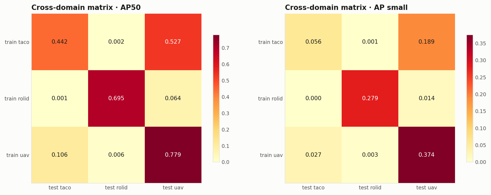
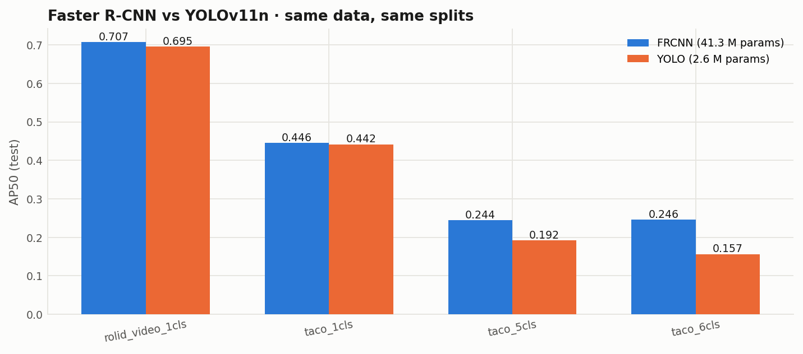

# Urban Waste Detection in Real Scenes

Cross-domain detection and segmentation of urban litter — handheld photos (TACO),
dashcam frames (RoLID-11K) and drone imagery (UAVVaste) — measuring how much detectors
degrade across viewpoints and what closes the gap.

**Final project · Computer Vision · MSc in Artificial Intelligence · UNI · 2026-I**
Jairzinho Santos — Prof. Elian Laura Riveros

| Resource | Where |
|---|---|
| Paper (IEEE 2-col, EN + ES) | `reports/paper/main.pdf` · `reports/paper/main_es.pdf` |
| Poster (A0 vertical, EN + ES) | `reports/poster/poster.pdf` · `reports/poster/poster_es.pdf` |
| **Demo video (YouTube, sectioned)** | *link pending — added on release* |
| Pretrained weights | GitHub **Releases** of this repo (Drive mirror linked there) |
| Development log (Spanish) | [docs/BITACORA.md](docs/BITACORA.md) |
| Architecture & contracts | [docs/ARQUITECTURA.md](docs/ARQUITECTURA.md) |

---

## What is in this project

- **4 model families, 19 experiments**: VGG-16 transfer learning + CAM/Grad-CAM/Guided
  Backprop, FCN-ResNet18 binary segmentation, Faster R-CNN (two fine-tuning strategies),
  and YOLOv11n as modern reference.
- **A 3×3 cross-domain matrix** (train on one domain, test on all), a **quantification of
  the video-level leakage we found in RoLID-11K's official splits** (58.2 % of test shares
  a video with train), a 640-vs-1024 resolution ablation for small objects, a
  6-vs-5-class taxonomy comparison, and a **TIDE error decomposition of all 13 detectors**.
- **Seven dataset defects (H1–H7) found and handled** through audited curation
  (medallion architecture raw → bronze → silver → gold, SHA-256 lineage).
- A **session-based demo**: drop your own photos in a folder and every model processes
  the batch — collages, per-image comparison strips and a summary table.
- Every metric for every model comes from the **same pycocotools evaluation against the
  same frozen GTs** — tables and figures are generated, never transcribed.

## Results at a glance

| Finding | Number |
|---|---|
| Cross-domain degradation (mAP50, in-domain 0.639 → cross 0.118) | **−82 %** |
| Leakage inflation in RoLID-11K's official splits (same test set) | **+21 % AP50** (0.844 vs 0.695) |
| Resolution 640→1024 on dashcam (median object 22 px) | **+8.3 AP50 / +5.8 AP-small** |
| YOLOv11n (2.6 M params) vs Faster R-CNN (41.3 M), single-class | within **1–4 AP50 points** |





## Requirements

- Python ≥ 3.9 (project developed on 3.9) · ~60 GB disk for full reproduction
  (routes A/B below need only megabytes)
- macOS (Apple Silicon, MPS), Linux/CUDA or Google Colab. CPU works for the demo.
- Each notebook installs its own dependencies on first run
  (`torch`, `torchvision`, `ultralytics`, `pycocotools`, `tidecv`, `pandas`,
  `matplotlib`, `pyarrow`, `gdown`; the demo also pulls `pillow-heif` and
  `pillow-avif-plugin` for iPhone/web image formats).

```bash
python3 -m pip install --user jupyterlab
python3 -m jupyter lab            # then open the notebook of the route you choose
```

Operating rule for every notebook: **Run All, always.** DONE markers, checkpoints and
caches make re-runs execute only what is pending — interrupting and re-running is safe.

---

## Three reproduction routes

### Route A — Demo with pretrained weights (~5 min, CPU is fine)

Try the trained models on **your own images**: photos downloaded from the web or taken
with your phone (jpg, png, webp, iPhone **HEIC** and web **AVIF** all supported).

1. Download `weights_demo.zip` from the latest GitHub **Release** and unzip it into
   `experiments/` (a Drive mirror is linked in the Release notes; the demo notebook can
   also fetch it for you via `WEIGHTS_URL`).
2. Create a session folder and drop your images there:
   ```
   demo/input/my_test/photo1.jpg, photo2.heic, ...
   ```
3. Open **`notebooks/07_demo_inferencia.ipynb`** → Run All. The latest session folder is
   picked up automatically — no code edits needed.
4. You get, per model, a **collage of the whole batch** (YOLOv11n boxes, Faster R-CNN
   boxes, FCN litter mask, Grad-CAM explanations), a **side-by-side comparison strip per
   image**, session indicators, and a summary table — everything also saved to
   `demo/output/my_test/`. Processing is memory-safe: sessions of dozens of images are
   fine on any machine.

### Route B — Reproduce the paper's numbers without retraining (~10 min)

The tables and figures of the paper are regenerated from the experiment artifacts
(metrics + saved test predictions — a few MB, no weights needed):

1. Download `experiments_artifacts.zip` from the Release and unzip into `experiments/`.
2. Run **`notebooks/03_export_gold.ipynb`** first if `data/gold/coco/` does not exist
   yet (evaluation GTs are rebuilt from public data — see Route C step 1–4), or download
   the `gold_coco_gt.zip` asset.
3. Run **`notebooks/06_evaluacion_consolidada.ipynb`** → Run All.
4. Everything lands in `reports/tablas/*.csv`, `reports/figuras_final/` and
   `reports/resultados_finales.json` — including the TIDE error decomposition.

### Route C — Full reproduction from public data (days of GPU)

| Step | Notebook | Time |
|---|---|---|
| 1 | `00_ingesta_descarga.ipynb` — downloads TACO/RoLID/UAVVaste with MD5 checks, builds bronze | ~20 min (1 Gbps) |
| 2 | `01_eda_bronze.ipynb` — EDA + audits (H1–H7), scope gate | ~10 min |
| 3 | `02_curacion_silver.ipynb` — corrections, taxonomy, frozen splits (self-asserting) | ~1 min |
| 4 | `03_export_gold.ipynb` — materializes pools, YOLO dirs, COCO GTs, masks, crops | ~10 min |
| 5 | `04_modelado_p0.ipynb` — VGG/FCN on Mac (~3 h); the 5 Faster R-CNNs on Colab A100 (~2.5 h GPU; set `EJECUTAR` per lane, `PAQUETE_COLAB_P0=True` in step 4 creates the Drive bundle) | ~6 h total |
| 6 | `05_modelado_p1_yolo.ipynb` — 8 YOLO runs; CUDA (Colab A100, ~8 h GPU) is the recommended lane (an intermittent Ultralytics-on-MPS bug kills long Mac runs) | ~8 h GPU |
| 7 | `06_evaluacion_consolidada.ipynb` — final tables, figures (ES + EN twins), TIDE | ~2 min |

Datasets are **not** attached (per course guidelines): notebook 00 downloads them from
their official sources — [TACO](https://zenodo.org/records/3587843) (CC BY 4.0),
[RoLID-11K](https://github.com/xq141839/RoLID-11K) (Apache-2.0),
[UAVVaste](https://zenodo.org/records/8214061) (CC BY 4.0) — with size and MD5
verification against each source's published checksums.

---

## Pretrained weights (Release assets)

| Asset | Contents | Size |
|---|---|---|
| `weights_demo.zip` | all 13 detectors (8 YOLO + 5 Faster R-CNN) + best FCN + best VGG | 1.30 GB |
| `experiments_artifacts.zip` | DONE.json metrics + test predictions for all 19 runs | 22 MB |
| `gold_coco_gt.zip` | evaluation ground-truths (Route B shortcut) | 3 MB |

SHA-256 checksums for every asset are in `dist/release_manifest.json` (attached to the
Release).

If any link is unavailable, the Drive mirror in the Release notes carries the same
files.

## Demo video

A sectioned walkthrough (YouTube) mirrors the oral presentation and then demonstrates
each execution route live — including detections on internet images and phone photos.
*Link will be published here with the Release.*

## Repository map

```
notebooks/   00 ingest · 01 EDA · 02 silver · 03 gold · 04 P0 · 05 P1 · 06 eval · 07 demo
docs/        ARQUITECTURA.md (architecture) · BITACORA.md (dev log, ES) · capture protocol
data/        raw/ bronze/ silver/ gold/     (created by notebooks; not versioned)
demo/        input/<session>/ output/<session>/   (your images in, annotated results out)
experiments/ p0/ p1/                        (metrics, weights, predictions)
reports/     paper/ · poster/ · tablas/ · figuras_*/
dist/        Release assets (weights_demo.zip, artifacts, GTs, SHA-256 manifest)
```

## Acknowledgements

Datasets by their respective authors (TACO — Proença & Simões; RoLID-11K — Wu et al.;
UAVVaste — Kraft et al.; ZeroWaste — Bashkirova et al.). Course activities of the UNI
Computer Vision class inspired the P0 methodology (transfer learning, CAM/Grad-CAM,
FCN, RPN).
