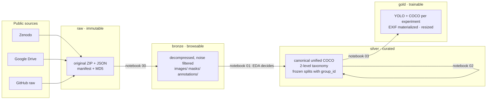
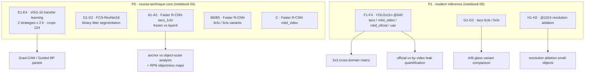

# Architecture - Data, Experiments and Contracts

Urban Waste Detection · Computer Vision · UNI · 2026-I

This document describes **how the project is structured**: the data architecture, the
per-layer contracts, the split schemes, the taxonomy and the experiment map. For the
development history and the rationale behind each decision, see [BITACORA.md](BITACORA.md)
(Spanish). For how to run everything, see the [README](../README.md).

---

## 1 · Medallion data architecture



| Layer | Path | Contract |
|---|---|---|
| **raw** | `data/raw/` | Immutable. ZIPs/JSONs exactly as downloaded, with manifest and official MD5 checksums. Never edited; fully re-downloadable |
| **bronze** | `data/bronze/` | Decompressed and browsable, homogeneous structure `<ds>/{images,masks,annotations}/`. No semantic transformation. Rebuildable from raw without network |
| **silver** | `data/silver/` | All curation decisions live here: corrections C1-C5, unified canonical COCO, taxonomy, frozen splits. **Marks, never deletes**: exclusions are flags with reasons |
| **gold** | `data/gold/` | Derivable and disposable. Materialized per-experiment formats: image pool (annotation-frame pixels, EXIF metadata stripped, max side 1280), YOLO dirs, COCO GTs, FCN masks, classifier crops |

Lineage is verified by SHA-256 at every hop: gold refuses to build if silver's artifacts
do not match silver's manifest.

## 2 · Datasets and their roles

| Dataset | Domain | Images | Classes | Role |
|---|---|---|---|---|
| **TACO** | handheld / pedestrian, Europe | 1,500 | 60 → material taxonomy | multi-class core, segmentation polygons |
| **RoLID-11K** | dashcam, UK | 11,564 | 1 (litter) | hard extreme (median object 22 px), reproducibility anchor |
| **UAVVaste** | drone, Poland | 772 | 1 (rubbish) | third viewpoint, official split |
| ZeroWaste-f | industrial conveyor | 4,503 | 4 | characterized in EDA, **excluded from modeling** (out-of-domain) |

Known upstream defects found by this project's audits (details in BITACORA, chapter 2-4):
TACO basename collisions across batches (H1) and pending EXIF rotation on ~37 % of images
(H2); RoLID release folder ≠ hour-of-day (H3), **video-level leakage in the official
splits 58.2 % of test shares a video with train (H4)** and one image duplicated
between val and test (H5); UAVVaste official split has one near-duplicate pair crossing
train/test (H6); annotation frames are not uniform across datasets (H7).

## 3 · Silver: corrections, taxonomy, splits

**Corrections (C1-C5):** RoLID val/test duplicate removed from val; phantom `None`
category dropped; TACO identity by full `batch_N/` path with per-image EXIF registry;
1 degenerate bbox flagged; exact MD5 duplicates flagged.

**Two-level taxonomy** (`silver/taxonomia.json`):

- **Level 1 - `litter`** (1 class, all datasets): enables the cross-domain matrix.
- **Level 2 - materials** (TACO only), in **two variants trained in parallel**:
  **A: 6 classes** (glass included, declared marginal at 38 test instances) ·
  **B: 5 classes** (glass excluded). Foam folds into rigid plastic; "others" and
  `Unlabeled litter` are excluded from level 2 (present in level 1).

**Frozen split schemes** (`silver/splits.csv`, one row per image × scheme):

| Scheme | Group unit | Notes |
|---|---|---|
| `taco_groupaware` | pHash visual group | iterative stratification (Sechidis 2011): every class lands at 15.0–15.1 % in test |
| `rolid_oficial` | video | official release with C1; **kept for comparability, known 58 % scene leakage** |
| `rolid_por_video` | video | honest correction of H4: 0 % leakage, annotations at 70/15/15 |
| `uavvaste_oficial` | pHash group | official release file |

## 4 · Experiment map (19 runs)



Execution mechanics shared by 04/05: hardware switch (MPS/CUDA/CPU), per-experiment
guardian (a failure never breaks the notebook), per-epoch checkpoints with resume,
budget guardian (projects total hours after the first epochs; aborts over
`PRESUPUESTO_HORAS_EXP`), NaN guardian with automatic quarantine of diverged runs,
DONE/FAILED registry and a status dashboard. Lanes: Mac (MPS) for VGG/FCN/YOLO;
Colab (CUDA) for the five Faster R-CNNs (measured ~95 s/iter on MPS → unviable locally).

## 5 · Evaluation contract

Single metric source: **every** model (P0 and P1) is evaluated with pycocotools against
the same `gold/coco/<experiment>_<split>.json` GTs. Test is touched once per experiment,
with the best-validation weights. Saved test predictions (`preds_*.json`,
`predicciones_test.json`) feed the consolidated evaluation and TIDE error decomposition
(notebook 06), which exports the paper's tables (`reports/tablas/*.csv`) and figures
no number is ever transcribed by hand.

## 6 · Repository layout

```
code/
├── README.md                      # how to run (EN) - 3 reproduction routes
├── docs/
│   ├── ARQUITECTURA.md            # this file
│   ├── BITACORA.md                # development log with findings H1–H7 (ES)
│   └── protocolo_captura_lima.md  # own OOD test-set capture protocol
├── notebooks/                     # 00 ingest · 01 EDA · 02 silver · 03 gold
│                                  # 04 P0 · 05 P1 · 06 consolidation · 07 demo
├── data/                          # raw/ bronze/ silver/ gold/ (not versioned)
├── experiments/                   # p0/ p1/ - DONE.json, weights, predictions
└── reports/                       # figures, tables, paper/
```
