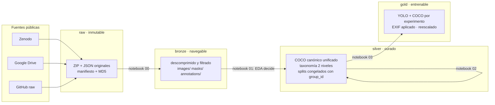
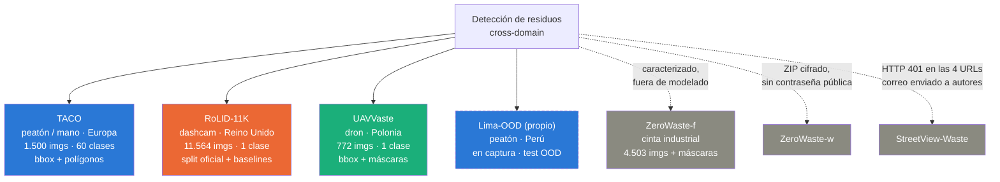
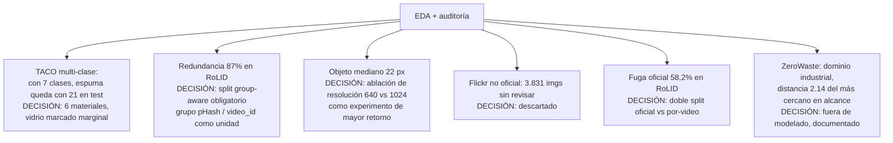
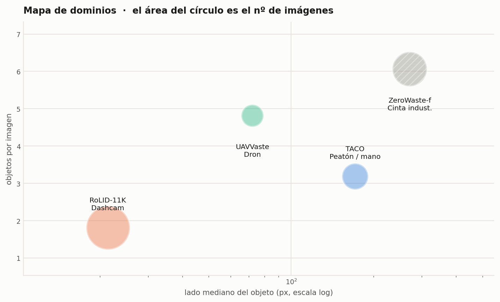
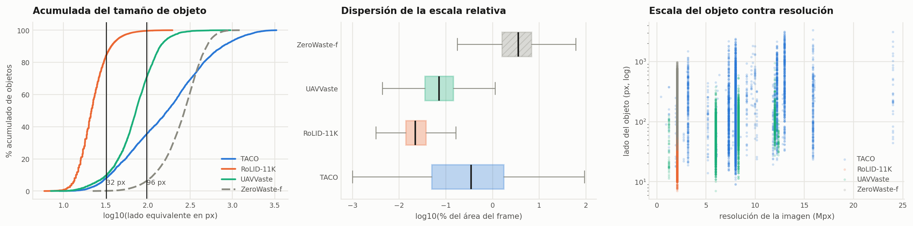
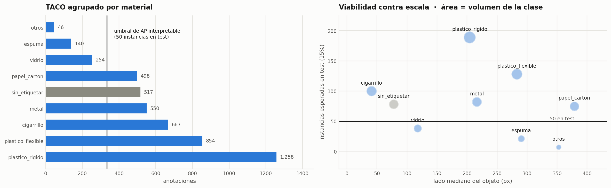
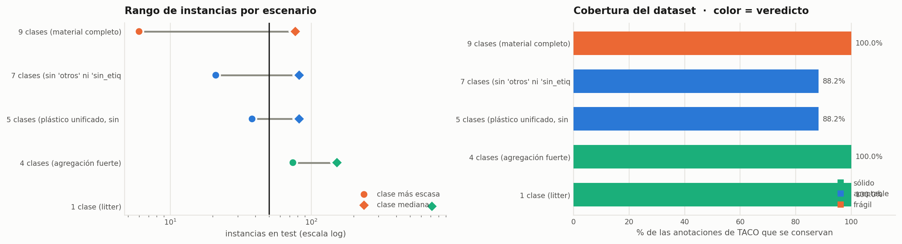

# Detección de Residuos Urbanos en Escenas Reales

**Proyecto final · Computer Vision · Maestría en Inteligencia Artificial · UNI · 2026-I**
Jairzinho Santos — Prof. Mg. Elian Laura Riveros

**Bitácora técnica del proyecto** (documento histórico, en español): crece un capítulo por
etapa y registra qué se hizo, por qué, qué se encontró y qué decisión salió de cada hallazgo.
Cada capítulo mapea a una notebook reproducible y a una sección del paper.

> Para **ejecutar o reproducir** el proyecto, ver el [README](../README.md) (inglés).
> Para la **arquitectura de datos y experimentos**, ver [ARQUITECTURA.md](ARQUITECTURA.md).

---

## Estado del proyecto

- [x] **Cap. 1 — Adquisición** (`00_ingesta_descarga.ipynb`): 21 GB en `raw/`, verificados y descomprimidos a `bronze/`
- [x] **Cap. 2 — EDA y auditoría** (`01_eda_bronze.ipynb`): 18.339 imágenes y 56.195 anotaciones caracterizadas; 6 decisiones de alcance tomadas
- [x] **Cap. 3 — Curación → `silver`** (`02_curacion_silver.ipynb`): C1–C5 aplicadas, taxonomía A/B, 4 esquemas de split congelados y verificados
- [x] **Cap. 4 — Export → `gold`** (`03_export_gold.ipynb`): pool 1280 + 6 exports YOLO + COCO + máscaras FCN + recortes CAM, validado por round-trip
- [x] **Cap. 5 — Modelado P0** (`04_modelado_p0.ipynb`): **11/11 experimentos DONE** — VGG y FCN en el carril Mac; los 5 Faster R-CNN en Colab A100 tras el veredicto del guardián de presupuesto
- [x] **Cap. 6 — Modelado P1** (`05_modelado_p1_yolo.ipynb`): **8/8 experimentos DONE** — F1 en Mac; el resto en Colab A100 tras el bug intermitente de MPS; matriz 3×3 y los 4 análisis completos
- [x] **Cap. 7 — Evaluación consolidada** (`06_evaluacion_consolidada.ipynb`): 19/19 consolidados; tabla maestra, matriz, fuga, ablación, A/B y TIDE (13 modelos) con figuras gemelas ES/EN
- [x] **Cap. 8 — Entregables y demo**: papers **ES y EN** (5 pp, IEEE 2 columnas, 0 placeholders) · pósteres A0 **ES y EN** · demo por sesiones (`07_demo_inferencia.ipynb`) con collages, tiras comparativas y figura cualitativa en los papers · `dist/` empaquetado (1.30 GB pesos + 22 MB artefactos + 3 MB GT)
- [ ] Publicar repo GitHub + Release (pesos + espejo Drive) y fijar `WEIGHTS_URL` en la 07
- [ ] Video YouTube seccionado + presentación (15 min)

Hilos externos: captura del set propio **Lima-OOD** (pendiente, protocolo en
[protocolo_captura_lima.md](protocolo_captura_lima.md); las imágenes web de la demo se
reemplazarán por capturas propias) y StreetView-Waste (HTTP 401 en sus 4 URLs; correo
enviado a los autores, sin respuesta al cierre).

---

## Capítulo 0 · El proyecto

### Contexto

La acumulación de residuos en espacios públicos afecta salud, turismo y calidad de vida, y su
monitoreo sigue siendo manual: costoso, lento y de cobertura limitada. La visión por computador
permite automatizarlo, y la literatura reciente (WACV 2026) publicó en paralelo varios datasets
del problema — pero cada uno vive en un *dominio* distinto: fotos de peatón, cámaras de
vehículo, drones. Ningún trabajo mide qué pasa al cruzarlos.

### Pregunta de investigación

> ¿Cuánto se degrada un detector de residuos al cambiar de **punto de vista**
> (peatón → vehículo → dron) y de **geografía** (Europa → Lima), y qué pesa más para cerrar
> la brecha: la arquitectura, la resolución de entrada, o un modelo fundacional *zero-shot*
> frente al *fine-tuning*?

El resultado principal es una **matriz de degradación cross-domain** — una cantidad relativa,
válida aunque los mAP absolutos sean bajos, que es lo esperable en este problema: TrashDet
(WACV-W 2026), con búsqueda de arquitectura dedicada y 30.5 M de parámetros, alcanza solo
19.5 mAP50 sobre un subconjunto de 5 clases de TACO.

### Arquitectura de datos

Arquitectura medallion: cada capa tiene un contrato explícito y es reconstruible desde la anterior.



| Capa | Regla |
|---|---|
| `data/raw/` | Inmutable. ZIP/JSON tal como llegaron, con manifiesto y MD5. Nunca se edita |
| `data/bronze/` | Descomprimido, sin transformación semántica. Reconstruible desde `raw` sin red |
| `data/silver/` | Toda la decisión de curación: correcciones, taxonomía, splits. No borra: **marca** |
| `data/gold/` | Derivable y desechable. Formatos listos para entrenar, uno por experimento |

```
code/
├── notebooks/          00_ingesta · 01_eda · 02_curacion (próx.) · ...
├── data/               raw/ bronze/ silver/ gold/ _eda/ _logs/
├── reports/figuras_eda/   figuras del EDA (170 dpi, listas para paper y póster)
└── docs/               protocolo de captura Lima-OOD
```

---

## Capítulo 1 · Adquisición de datos — `00_ingesta_descarga.ipynb`

### Qué se descargó y por qué

El proyecto exige el mismo objeto (`litter`) visto desde dominios distintos. Se evaluaron seis
fuentes; tres quedaron en alcance de modelado, una como referencia caracterizada y dos fuera.



| Dataset | Rol en el proyecto | Licencia | Fuente |
|---|---|---|---|
| **TACO** | Núcleo demostrable: multi-clase, segmentación, escenas variadas | CC BY 4.0 | Zenodo (2.72 GB, MD5 verificado) |
| **RoLID-11K** | Extremo difícil (objeto mediano de 22 px) y ancla de comparabilidad: único con split oficial y baselines publicados | Apache-2.0 | Google Drive (5.2 GB) |
| **UAVVaste** | Tercer punto de vista (aéreo), split oficial propio | CC BY 4.0 | Zenodo (3.01 GB, MD5) |
| **detect-waste** | Anotaciones de TACO con etiquetas corregidas (Extended TACO) | ver repo | GitHub (43 MB) |
| ZeroWaste-f/w | Referencia de dominio industrial; excluido de modelado (ver Cap. 2) | CC BY-NC 4.0 | Zenodo (10.8 GB) |

### Propiedades de la ingesta

Descarga paralela y **reanudable** (`curl -C -`), verificación por **MD5 oficial de Zenodo**
donde existe y por parseo de contenido donde no, `caffeinate` contra la suspensión, y
descompresión **idempotente y auto-reparable**: recalcula el plan en cada corrida y completa
solo lo que falte. La notebook nunca borra nada por su cuenta; rehacer algo exige nombrarlo
explícitamente (`FORZAR_REDESCARGA` / `FORZAR_REEXTRACCION`).

Conteos de `bronze/` contrastados contra las publicaciones originales: **exactos** en los
cuatro datasets (1.500 · 11.564 · 772 · 4.503 + 4.503 máscaras).

### Hallazgos de la adquisición

| # | Hallazgo | Consecuencia |
|---|---|---|
| A1 | `TACO.zip` incluye el repo git completo y 14 *resource forks* de macOS que un conteo ingenuo confunde con imágenes (parecen 1.514; son **1.500**) | filtrado al pasar a bronze |
| A2 | `zerowaste-w.zip` está **cifrado con contraseña** no publicada (MD5 correcto; extracción imposible) | excluido; documentado |
| A3 | StreetView-Waste (WACV 2026) anuncia descarga pública pero sus 4 ZIP devuelven **HTTP 401** | correo a autores; el proyecto no depende de él |
| A4 | Las 3.831 imágenes de `annotations_unofficial.json` de TACO **no están** en el ZIP (solo sus URLs de Flickr) | scraping descartado por enlaces caídos y etiquetado no revisado |

**Artefactos:** `data/raw/` (21 GB + `_manifest_descarga.json`) · `data/bronze/` (18.8 GB navegables).

---

## Capítulo 2 · EDA y auditoría — `01_eda_bronze.ipynb`

### Método

En detección de objetos el EDA no es sobre las imágenes: es sobre el par **(imagen, anotación)**.
El primer paso convierte el corpus completo en dos tablas y todo el análisis posterior es tabular:

| Tabla | Grano | Contenido |
|---|---|---|
| `data/_eda/imagenes.parquet` | 18.339 filas | resolución, modo, EXIF, MD5, pHash/dHash, nitidez, luminancia, contraste, colorido |
| `data/_eda/anotaciones.parquet` | 56.195 filas | clase, bbox, área absoluta y relativa, posición normalizada, polígono, tamaño COCO |

Sobre ellas corren 9 partes: integridad física, integridad de anotaciones, caracterización de
dominio, diversidad visual (PCA + distancia entre dominios), *contact sheets* de recortes
anotados, taxonomía y síntesis. Los hashes perceptuales, la nitidez (varianza del laplaciano),
el colorido (Hasler-Süsstrunk) y el PCA están implementados sobre numpy puro.

### Lo que muestran los datos

**La escala del objeto es el eje que separa los dominios.** El objeto mediano de RoLID ocupa
1 de cada 4.464 píxeles del frame — invisible a simple vista, aunque el 100 % de sus imágenes
está anotado:

| Dataset | Lado mediano | % del área del frame | % objetos *small* (COCO) | Obj/img |
|---|---:|---:|---:|---:|
| TACO | 171 px | 0.350 % | 25 % | 3.2 |
| UAVVaste | 72 px | 0.072 % | 66 % | 4.8 |
| RoLID-11K | **22 px** | **0.022 %** | **84 %** | 1.8 |

**Integridad casi perfecta:** 1 sola anotación con defecto geométrico entre 56.195 (una caja
23:1 en TACO). Cero imágenes corruptas. La distribución de tamaños de RoLID reproduce la
Figura 4 de su paper dígito a dígito — prueba de que tenemos exactamente el release publicado.

**La redundancia define cómo se puede partir la data:** pHash agrupa el **87 %** de RoLID en
grupos de casi-duplicados (frames consecutivos de video; el mayor grupo: 7.345 imágenes),
contra 0.3–0.4 % en TACO y UAVVaste.

**Distancia entre dominios medida** (centroides PCA normalizados por dispersión interna):
RoLID es el dominio más lejano de todos (2.44 frente a UAVVaste, 1.78 frente a TACO);
TACO y UAVVaste se solapan (0.46). Anticipa dónde dolerá la transferencia.

### Auditoría: defectos encontrados (nuestros y de los datasets)

| # | Defecto | Evidencia | Corrección |
|---|---|---|---|
| H1 | **TACO: colisión de nombres entre batches** — `000006.jpg` existe en 9 batches; 1.386 de 1.500 imágenes comparten nombre base | conteo exhaustivo | toda identidad usa la ruta completa `batch_N/` + `img_uid` |
| H2 | **TACO: rotación EXIF pendiente** en ~37 % de imágenes; las cajas están anotadas sobre la imagen ya girada | 200/200 imágenes coinciden con dims declaradas tras `exif_transpose` | todo dibujo aplica EXIF; gold materializa el pixel corregido |
| H3 | **RoLID: la carpeta 0–23 no es la hora del día** — es índice de sesión (solo 64/11.564 coinciden con el timestamp real del nombre de archivo) | verificación contra timestamps | hora real y `video_id` se derivan del nombre |
| H4 | **RoLID: fuga a nivel de video en los splits oficiales** — 22 de 84 videos reparten frames en más de un split; **58,2 % del test comparte video con train** | cruce video × split | doble evaluación: split oficial (comparable) + split por video (honesto) |
| H5 | RoLID: 1 imagen duplicada entre validation y test (ids 969/1520) + categoría fantasma `None` sin anotaciones | inspección de JSON | se retira de validation; `None` se elimina |

H4 es el hallazgo mayor: frames consecutivos son casi idénticos, así que **los baselines
publicados del paper de RoLID están inflados por fuga de escena**. Cuantificar esa inflación
(mismo modelo, dos splits) es uno de nuestros experimentos.

### El gate: decisiones de alcance



La decisión D1 en detalle — instancias proyectadas en un test del 15 %:

| Material | Anotaciones | En test | ¿AP interpretable? |
|---|---:|---:|---|
| plástico rígido | 1.258 | 189 | sí |
| plástico flexible | 854 | 128 | sí |
| cigarrillo | 667 | 100 | sí (pero lado mediano 41 px) |
| metal | 550 | 82 | sí |
| papel-cartón | 498 | 75 | sí |
| vidrio | 254 | 38 | **marginal** |
| espuma | 140 | 21 | no → se pliega |
| otros | 46 | 7 | no → se pliega |
| sin etiquetar | 517 | — | excluida del multi-clase, presente en 1-clase |

**Artefactos:** los dos parquet · `data/_eda/hallazgos_eda.json` (gate en JSON) ·
37 figuras en `reports/figuras_eda/`.

Figuras de referencia (se regeneran al ejecutar la notebook):

| | |
|---|---|
|  |  |
|  |  |

---

## Capítulo 3 · Curación → `silver` — `02_curacion_silver.ipynb`

### Principios

1. **Marca, no borra**: las exclusiones son banderas con motivo, no eliminaciones.
2. **Alternativas en paralelo**: las decisiones abiertas se materializan en variantes y se
   resuelven con resultados, no por preferencia.
3. **Splits congelados y autoverificados**: la notebook corre una batería de aserciones
   duras antes de exportar; si una falla, no se escribe nada.

### Correcciones aplicadas (C1–C5)

La imagen duplicada de RoLID se retira de validation (queda en test), la categoría fantasma
`None` desaparece, TACO queda identificado por ruta completa con su rotación EXIF registrada
(560 imágenes; el pixel se corrige al materializar gold), la bbox degenerada queda marcada y
los duplicados MD5 flagueados.

### Taxonomía de dos niveles, con variantes

- **Nivel 1 · `litter`** — común a los tres datasets; habilita la matriz cross-domain.
- **Nivel 2 · materiales (TACO)** — dos variantes que solo difieren en vidrio:
  **A: 6 clases** (vidrio incluido, 38 instancias en test, declarado marginal) ·
  **B: 5 clases** (vidrio excluido). Gold exporta ambas y el modelado reporta las dos
  columnas: la comparación aísla exactamente el efecto de incluir una clase escasa.
- Plegados declarados: espuma → plástico rígido (EPS es plástico); "otros" y
  `Unlabeled litter` fuera del nivel 2 (no constituyen un material), presentes en nivel 1.

### Splits congelados — `silver/splits.csv`

| Esquema | Unidad de grupo | Nota |
|---|---|---|
| `taco_groupaware` | grupo visual pHash | estratificación iterativa por grupos (Sechidis 2011): todas las clases quedan a 15.0–15.1 % en test |
| `rolid_oficial` | video | release oficial con C1; **58,2 % de fuga conocida (H4)**, se conserva por comparabilidad |
| `rolid_por_video` | video | corrección de H4: fuga **0.0 %**, anotaciones a 70.0/15.0/15.0 exactos |
| `uavvaste_oficial` | grupo visual | split oficial del release |

### Dos hallazgos de esta etapa

**H6 — el split oficial de UAVVaste también tiene fuga**, en miniatura: la batería de
validación detectó un par de frames consecutivos del mismo vuelo repartido entre train y
test (`batch_s01_img_1060` / `img_1440`, pHash a 3 bits). Impacto despreciable, pero
confirma el patrón: ningún release revisado parte por escena.

**El proceso también se auditó a sí mismo**: la batería rechazó el primer algoritmo de
split (un greedy por déficit escalar que dejaba a cigarrillo con 15 instancias en test
contra ~100 esperadas) y forzó su reemplazo por la estratificación iterativa. Las
aserciones no son ceremonia: atraparon un defecto real antes de exportar.

**Artefactos:** `silver/coco/{taco,rolid11k,uavvaste}.json` (COCO canónico con banderas) ·
`silver/taxonomia.json` · `silver/splits.csv` (25.400 filas, 4 esquemas) ·
`silver/_manifest.json` (conteos, semilla y SHA-256 de cada artefacto).

## Capítulo 4 · Export → `gold` — `03_export_gold.ipynb`

La única capa derivable y desechable: se regenera entera desde silver + bronze. Materializa
lo que consume cada modelo del portafolio:

| Artefacto | Consumidor | Detalle |
|---|---|---|
| `gold/pool/<ds>/` | todos | una copia física por imagen, **materializada en el marco de las anotaciones** y sin metadatos EXIF, lado máx. 1280, Lanczos, JPEG q95 (~4 GB) |
| `gold/yolo/<exp>/` | YOLO (05) | 6 experimentos con symlinks al pool, labels propios y `data.yaml` portable |
| `gold/coco/<exp>_<split>.json` | FRCNN (04) + **evaluación de todos** | coordenadas escaladas; polígonos incluidos en TACO. Única fuente de verdad métrica |
| `gold/masks/taco/` | FCN (04) | máscaras binarias litter/fondo rasterizadas de los polígonos |
| `gold/crops/<ds>/` | VGG+CAM (04) | recortes 224×224 litter/fondo 1:1, split-aware |
| `gold_colab_p0/p1.zip` | carril Colab | copias reales (los symlinks no sobreviven al zip); opt-in |

Decisiones aplicadas: banderas de silver filtradas, **negativos envenenados excluidos con
conteo por variante** (una imagen cuyo único contenido es de clases excluidas no puede
entrenarse como fondo — la variante 5cls pierde además las imágenes solo-vidrio, y esa
diferencia es parte de la comparativa A/B), nombres seguros `batch_N__archivo.jpg` (H1),
y verificación de linaje por SHA-256 contra el manifiesto de silver antes de construir.

Validaciones automáticas: conteos contra `splits.csv`, **disjunción física** de splits
resolviendo symlinks, **round-trip YOLO→COCO con IoU ≥ 0.995** (prueba de la cadena
EXIF → escala → normalización) y mosaicos visuales de cada experimento con sus labels
finales dibujados.

**Hallazgo H7 (atrapado por la propia materialización):** el marco de anotación no es
uniforme entre datasets. TACO anota sobre la imagen ya girada por EXIF (H2), pero
**UAVVaste contiene 5 fotos de mano/GoPro anotadas sobre el pixel crudo**
(`camera_img_0/1/2`, `GOPR0047/0052`): aplicarles la rotación EXIF desalineaba sus cajas
90°. La regla correcta es por imagen — materializar en el marco que coincide con las
dimensiones declaradas — y el pool se guarda sin metadatos EXIF para que ningún framework
pueda re-rotar al cargar.

## Capítulo 5 · Modelado P0 — `04_modelado_p0.ipynb`

Once experimentos alineados a las técnicas del curso: VGG-16 transfer (E1–E4, 2 estrategias
× 2 lr), FCN-ResNet18 (D1–D2), Faster R-CNN R50-FPN (A1–A2 congelado/layer4, B6/B5
multiclase, C dashcam), más el análisis de cobertura de anclas y los mapas de objectness
del RPN.

### La mecánica que hizo posible correr durante días

Cada experimento corre dentro de un **guardián** (`ejecutar()`): un fallo escribe
`FAILED.json` con el traceback y la notebook continúa con el siguiente; un cierre limpio
escribe `DONE.json` con métricas e historia. Checkpoints por época con reanudación,
`Run All` idempotente (lo DONE se salta), y liberación de memoria en el `finally`. A esa
base se sumaron tres guardianes nacidos de incidentes reales:

| Guardián | Incidente que lo motivó |
|---|---|
| **NaN + cuarentena** | A1 divergió (lr 0.005 sin warmup) y registró 11 épocas NaN como si nada; la corrida quedó en `_cuarentena_*` y el reintento usó warmup lineal + `clip_grad_norm` + lr 0.001 |
| **Presupuesto en horas** | un umbral ingenuo de "s/iter" — calibrado sin querer sobre iteraciones NaN, que son rápidas — marcó como lentos a todos los FRCNN sanos. Se reemplazó por una proyección de horas tras las primeras iteraciones medidas, contra `PRESUPUESTO_HORAS_EXP = 20` |
| **Doble carril Mac/Colab** | el perfilado mostró la patología de fondo: MPS recompila kernels Metal por **cada forma de entrada** — y Faster R-CNN produce formas variables. Iteración sana: ~95 s en MPS contra ~0.3 s en CUDA |

El guardián de presupuesto emitió veredictos inapelables en la Mac — proyecciones de
**315 h (A1) a 1.511 h (C)** — con el mensaje "mover este experimento al carril Colab".
Los cinco FRCNN se entrenaron en Colab (A100, ~5.3 unidades/h) escribiendo checkpoints
directamente en Drive; los resultados se copiaron de vuelta y la notebook local consolidó.

### Resultados P0 (test, misma vara pycocotools)

| Exp | Modelo · datos | Métrica test |
|---|---|---|
| E4 | VGG-16 último bloque · recortes 224 | **acc 0.978** |
| D1 | FCN-ResNet18 · litter/fondo | **IoU 0.577** |
| A2 | FRCNN layer4 · taco 1cls | AP50 0.483 (congelado A1: 0.446 → **+3.7 por descongelar layer4**) |
| B6 / B5 | FRCNN · 6cls / 5cls | 0.246 / 0.244 (empate en test) |
| **C** | FRCNN · rolid por-video | **AP50 0.708** — val y test casi idénticos: el split por video generaliza limpio |

## Capítulo 6 · Modelado P1 — `05_modelado_p1_yolo.ipynb`

Ocho YOLOv11n: F1–F4 por dominio @640, G1/G2 (6/5 clases), H1/H2 (@1024 para la ablación).
La premisa "YOLO rinde en MPS porque sus entradas son fijas" resultó cierta a medias.

### La noche de los tres crashes (y el cuarto veredicto)

F1 (taco @640) entrenó completo en la Mac (0.541, 150 épocas). Pero un **bug intermitente
del `TaskAlignedAssigner` de Ultralytics sobre MPS** ("shape mismatch... cannot be
broadcast") tumbó F4 en la época 59, G1 en la 17 y G2 en la 31 — error no determinista,
imposible de atrapar sin parchear la librería. H1 (@1024) ni siquiera llegó a eso: el
guardián de presupuesto proyectó ~25 h y lo expulsó. Decisión: detener el carril Mac y
entrenar los 7 restantes en Colab A100 (CUDA es inmune al bug) — **todos cerraron limpios
en ~7.5 h de GPU**, con el runtime sobreviviendo incluso a una desconexión de la UI durante
la noche.

### La evaluación tuvo su propia saga: los tres modos de fallo de MPS

Las celdas de análisis (matriz 3×3, fuga, ablación) corren inferencia local. Ahí apareció
el tercer y más peligroso modo de fallo de MPS:

1. **Lento** (recompilación por forma) — conocido desde P0.
2. **Crash**: el driver Metal abortó el kernel de Python **dos veces**, con firma idéntica
   (`SIGABRT` en `_mps_convolution`), siempre al iniciar inferencia @1024 sobre RoLID.
3. **Corrupción silenciosa**: la evaluación de H1→taco @1024 en MPS *terminó sin error*
   pero produjo basura — se detectó porque emitió **2.748 detecciones donde el patrón
   sano son ~19.400** y un AP50 de 0.046 contra un val de 0.568. El archivo envenenado
   se regeneró por CPU: 0.474, coherente.

Curas aplicadas: **caché idempotente de predicciones** (`preds_*.json` se escribe solo al
completar una inferencia entera; un reintento rehace únicamente lo pendiente — el segundo
crash costó ~30 s en vez de 35 min) y **fallback a CPU para toda inferencia ≥1024 px bajo
MPS**. La regla de sospecha quedó institucionalizada: *validar el volumen de predicciones,
no solo la ausencia de excepciones*.

### Resultados P1 (val AP50 → test en Cap. 7)

F1 0.541 · F2 0.731 · F3 0.652 · F4 0.739 · G1 0.214 · G2 0.263 · H1 0.568 · **H2 0.797**.

## Capítulo 7 · Evaluación consolidada — `06_evaluacion_consolidada.ipynb`

Una sola vara: los 19 experimentos evaluados con pycocotools contra los mismos GT congelados
de gold; las tablas del paper salen de `reports/tablas/*.csv` — ningún número se transcribe
a mano. Los cuatro hallazgos numéricos:

| Hallazgo | Números |
|---|---|
| **Los detectores no viajan** | in-domain 0.639 AP50 medio → cruzado 0.118: **−82 %**. Dashcam es una isla (≤0.064 en ambas direcciones); mano→dron retiene el 68 % (0.527/0.779). La escala del objeto — no la apariencia — domina |
| **La fuga infla +21 %** | sobre el mismo test por-video: el modelo entrenado con el split oficial (que vio esos videos) marca **0.844** contra **0.695** del entrenado limpio. Los baselines publicados de RoLID deben leerse con ese sesgo |
| **La resolución paga donde duele** | 640→1024: dashcam **+8.3 AP50 / +5.8 AP-small**; mano +3.2 / +3.9 |
| **El vidrio marginal cobra impuesto** | 5cls 0.192 vs 6cls 0.157 global; +0.014 medio en las clases compartidas (metal +0.077); vidrio solo llega a 0.049 |

**TIDE también tuvo su defecto**: `tidecv` exige `segmentation` en cada anotación y los GT
bbox-only (RoLID/UAV) no lo llevan — el `KeyError` descartaba la sección entera tras
procesar 4 modelos. Cura: copia temporal parcheada del GT (polígono = rectángulo del bbox,
gold intacto) + guardián por modelo. Resultado: **13/13 detectores descompuestos**, con
tres regímenes nítidos — multiclase dominado por clasificación (hasta 24.6 dAP), 1-clase
mano repartido entre fondo y no-detectados, y dashcam in-domain casi sin Miss (≤3.9):
los objetos de 22 px *sí se encuentran*; el colapso cross-domain nace de las
representaciones.

Las cinco figuras clave se generan en **gemelas ES/EN** desde los mismos datos
(`*_en.png`), de modo que cada paper y póster habla un solo idioma.

## Capítulo 8 · Entregables y demo

### Papers y pósteres (ES + EN)

Paper IEEE dos columnas, 5 páginas por idioma, abstract de 126 palabras, 5 tablas +
figura TIDE + figura cualitativa de la demo, compilando sin errores ni desbordes.
Pósteres A0 verticales (`tikzposter`) con la paleta del proyecto, iterados visualmente
hasta encajar al milímetro (gotcha real: la fuente de versalitas del título no tiene el
glifo "¿" — se generó rotando el "?").

### La demo por sesiones (`07_demo_inferencia.ipynb`) y la lección de memoria unificada

La demo evolucionó de "una imagen a la vez" a **sesiones**: soltar imágenes en
`demo/input/<nombre>/` (jpg/png/webp/**HEIC**/**AVIF**), Run All, y salen collages por
modelo, **tiras comparativas por imagen** (Original con el origen del recorte Grad-CAM
marcado en punteado · YOLO · FRCNN · FCN · Grad-CAM), indicadores, créditos extraídos de
EXIF/XMP y `summary.csv` — todo persistido en `demo/output/<nombre>/`.

El incidente que forjó su diseño final: la primera versión pasaba las N imágenes a Faster
R-CNN **en un solo forward** — con 9 fotos, las activaciones del R50-FPN a 1280 px
(~2–4 GB por imagen) agotaron la memoria unificada del M5 Max y **reiniciaron la máquina**.
Cura: inferencia imagen-por-imagen (memoria plana, sesiones de decenas de imágenes en
cualquier máquina) + `free_memory()` al cerrar cada sección + el fallback CPU @1024
heredado del Cap. 6.

La sesión de 10 imágenes web fuera de distribución reprodujo los patrones del protocolo
cuantitativo (FRCNN propone más que YOLO en las 10: 211 vs 87 detecciones) y alimenta la
figura cualitativa de ambos papers; los créditos siguen la metadata donde existe
(1 de 10 con autoría embebida) y las imágenes se reemplazarán por capturas propias.

### Empaquetado

`scripts/empaquetar_release.py` construye `dist/`: `weights_demo.zip` (1.30 GB — los 13
detectores + mejor VGG y FCN), `experiments_artifacts.zip` (22 MB — métricas y
predicciones de test de los 19), `gold_coco_gt.zip` (3 MB) y el manifiesto SHA-256.

## Capítulo 9 · Lecciones aprendidas

1. **Auditar antes de entrenar**: una fuga escondida (H4) reescribe un benchmark; el costo
   de encontrarla fue una fracción del costo de entrenar sobre ella sin saberlo.
2. **Guardianes fail-fast > optimismo**: presupuesto en horas, NaN y cuarentena convirtieron
   noches de cómputo incierto en decisiones automáticas y auditables.
3. **Una sola vara métrica**: evaluar P0 y P1 con el mismo pycocotools contra los mismos GT
   fue lo que hizo comparables las tablas — y lo que permitió detectar números imposibles.
4. **Idempotencia como seguro de vida**: DONE/FAILED, caché de predicciones y sesiones de
   demo sobrescribibles hicieron que cada crash costara minutos, no días.
5. **MPS falla de tres maneras** — lento (recompilación por forma), crash (assert de Metal
   @1024) y **corrupción silenciosa** — y la tercera solo se detecta validando el volumen
   y la coherencia de las predicciones, nunca la ausencia de excepciones.
6. **La memoria unificada de Apple Silicon no perdona lotes grandes**: un batch de
   detección a 1280 px puede tumbar el sistema entero; secuencial + liberación explícita
   es el patrón correcto para demos.
7. **El presupuesto de horas como criterio de viabilidad** (≤20 h por experimento) fue más
   útil que cualquier métrica de velocidad instantánea.
8. **Alternativas en paralelo** (6 vs 5 clases, oficial vs por-video) resolvieron con
   evidencia lo que hubiera sido debate de opinión.

## Capítulo 10 · Oportunidades de mejora y siguientes pasos

**Corto plazo (post-entrega):**
- Reemplazar las imágenes web de la demo por **capturas propias en Lima** (protocolo listo)
  y regenerar la figura cualitativa de los papers.
- Set **Lima-OOD** anotado como cuarto dominio de test: mide la brecha geográfica
  (Europa → Perú) que la pregunta de investigación dejó planteada.
- Publicar los splits corregidos como archivos independientes para que otros trabajos
  sobre RoLID puedan evaluar sin fuga.

**Mediano plazo:**
- **Detectores transformer** (CO-DETR y afines), que lideran el benchmark in-domain de
  RoLID por >20 AP50 — nuestro presupuesto los excluyó.
- **Agregación temporal sobre video** de dashcam: la estructura de video que la auditoría
  expuso es exactamente la señal que un detector por-frame desperdicia.
- **Diseño desacoplado** sugerido por TIDE: detector agnóstico a la clase + clasificador
  de recortes (97.8 % de acc) en cascada, contra cabezas de detección cada vez más finas.
- **Tiling/SAHI** para el régimen de 22 px: complementa la ablación de resolución.

**Largo plazo:**
- StreetView-Waste (cámaras ojo de pez de camiones) como cuarto punto de vista, si los
  autores responden.
- Cuantización y despliegue edge del YOLOv11n (2.6 M): el argumento "ligero y desplegable"
  merece medirse en hardware municipal real.

---

## Reproducibilidad

La guía de ejecución vive en el [README](../README.md) (inglés), con tres rutas: demo con
pesos preentrenados (~5 min), regeneración de las métricas del paper desde los artefactos
publicados (~10 min), y reproducción completa desde los datos públicos. Referencia rápida
de la ruta completa, con los carriles que realmente se usaron:

| Paso | Notebook | Nota |
|---|---|---|
| 1 · Descarga + bronze | `00_ingesta_descarga.ipynb` | reanudable e idempotente; ~20 min con buena conexión |
| 2 · EDA | `01_eda_bronze.ipynb` | escaneo inicial 3–8 min (M-series); reejecuciones usan caché parquet |
| 3 · Curación | `02_curacion_silver.ipynb` | ~1 min; aserciones duras antes de exportar |
| 4 · Gold | `03_export_gold.ipynb` | ~10 min; `PAQUETE_COLAB_P0/P1` para el carril nube |
| 5 · Modelado P0 | `04_modelado_p0.ipynb` | Mac: VGG/FCN (~3 h) · Colab A100: los 5 FRCNN (~2.5 h GPU); reanudable por época |
| 6 · Modelado P1 | `05_modelado_p1_yolo.ipynb` | F1 viable en Mac (~2.5 h); los 8 en Colab A100 ≈ 8 h GPU (el bug MPS del assigner hace CUDA el carril recomendado) |
| 7 · Consolidación | `06_evaluacion_consolidada.ipynb` | ~2 min; produce `reports/tablas/` y `reports/figuras_final/` (incluye gemelas EN) |
| 8 · Demo | `07_demo_inferencia.ipynb` | sesiones en `demo/input/<nombre>/`; CPU suficiente; ~20 s por imagen |

Regla de operación en todas: **Run All siempre** — los marcadores DONE, la cuarentena, la
caché de predicciones y los checkpoints se encargan de ejecutar solo lo pendiente.

Los datasets no se versionan en el repo: la notebook 00 los descarga de sus fuentes oficiales
con verificación de integridad. Únicos requisitos: ~60 GB de disco y conexión estable.
